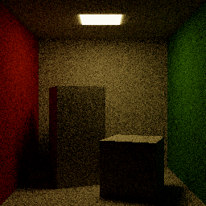

# Lucifer

Lucifer is a physically based renderer, written as a tutorial on how
to implement raytracing and pathtracing in Rust.



Lucifer tries to showcase a very clean and easy-to-understand
implementation of the basics of 3D rendering using raytracing.

The first few [commits](https://github.com/ennocramer/lucifer) are
structured as a tutorial, showing the implementation of the core
structures and algorithms of a [path
tracing](https://en.wikipedia.org/wiki/Path_tracing) renderer.

## Building

Lucifer is written in [Rust](https://www.rust-lang.org/) and may,
depending on when you're trying to build it, require on the nightly
release of the Rust compiler.

``` sh
# Install Rust via Rustup
$ curl https://sh.rustup.rs -sSf | sh

# Install nightly release, if necessary
$ rustup install nightly
$ rustup default nightly

# Build lucifer
$ cargo build --release

# Run lucifer to generate the example output
$ cargo run --release example.png
```

## Core Concepts

### Space

Space is represented using the `Vector` and `Point` types, taken from
the [cgmath crate](https://crates.io/crates/cgmath).  `Point`
represents positions in space, while `Vector` represents directions
and distances between points.

A `Ray` is a straight line through space.  It has an origin, a
direction, and a possibly infinite length.  Rays represent the path
photons travel unhindered after being emitted, until interacting
(possibly being absorbed or reflected) with the surface of an object.

An `Intersection` describes a location where a photon hits, and
interacts with, an object. It consists of the point in space where the
intersection occurred, the object's surface's normal vector, the
distance from the photon's origin, and a boolean indicating whether
the surface was hit from the object's inside or outside.

A `Geometry` is the abstraction of a physical shape. It provides
methods for intersections tests between itself and `Ray`s.

